### Pathfinder Web Application for Web Development Class Spring 2024
Pathfinder was built using Flask, SQLite, Bootstrap, HTML, CSS 

## Team
- Team Lead: Alex Corcoran
- Team: Conor Weiss

## Project Description
Pathfinder is a Portland-specific directory of tech and tech-related businesses. It is a full-stack application that allows users to register, login, and search/favorite businesses of interest. There are several ways to filter businesses, such as by industry, zip code, keyword, and business type. Each business has a profile page and map location. Pathfinder is intended to be a resource to learn about companies that are either smaller/less well known, not partnered with or highlighted by the Roux, or have tech positions open but are not explicitly tech companies, like banks or healthcare systems.

## Current Prototype Screenshots
Home Page 
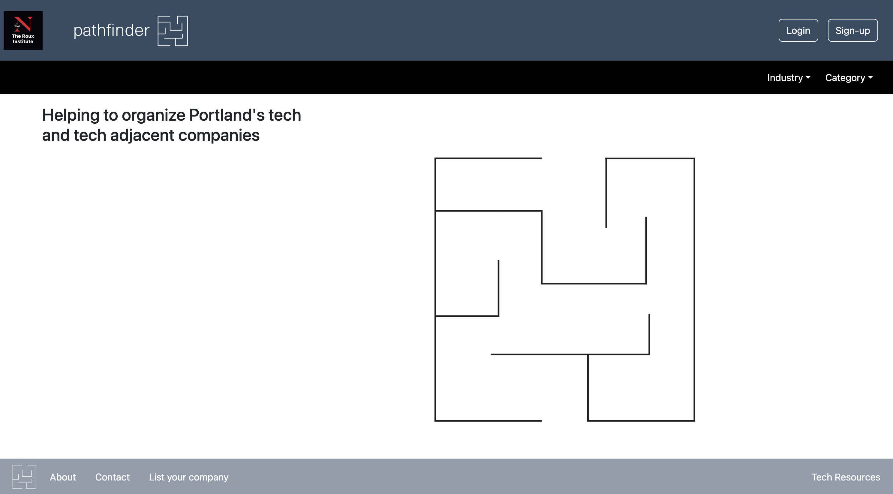
 
 
 

Home Page with Industry Hover 
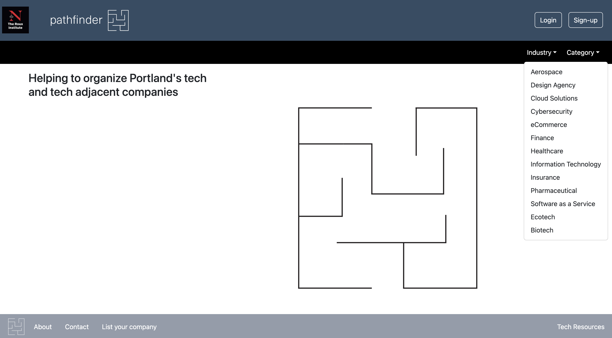
 
 
 

Logged In Showing A-Z Filter with Keyword Hover 
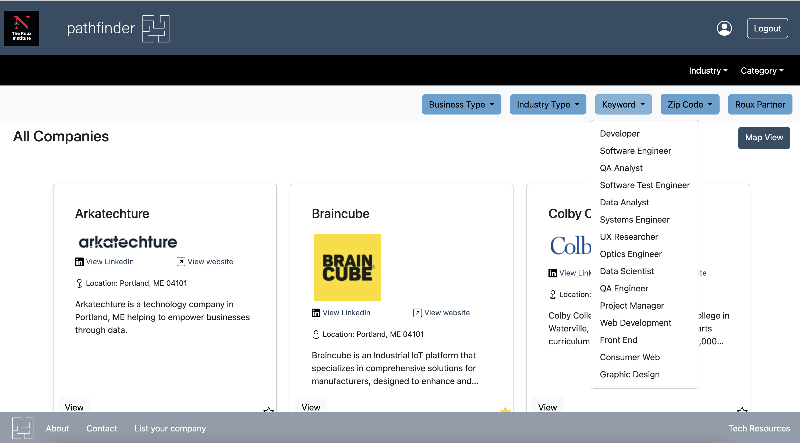
 
 
 

Map View of A-Z Companies 
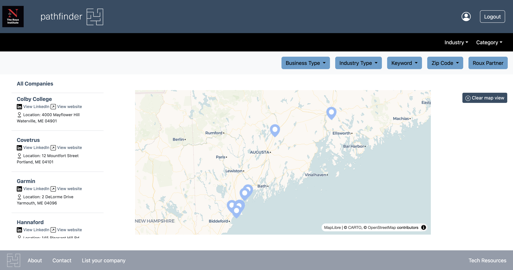
 
 
 

Company Full Profile View 
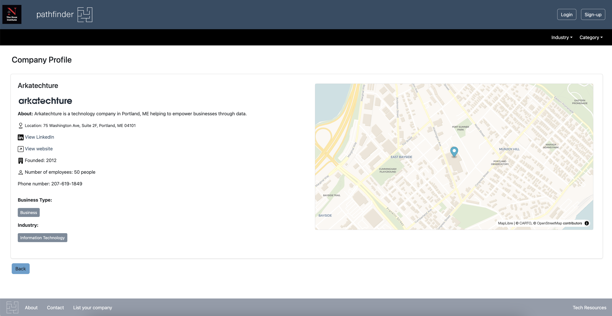
 
 
 

Favorites Page 
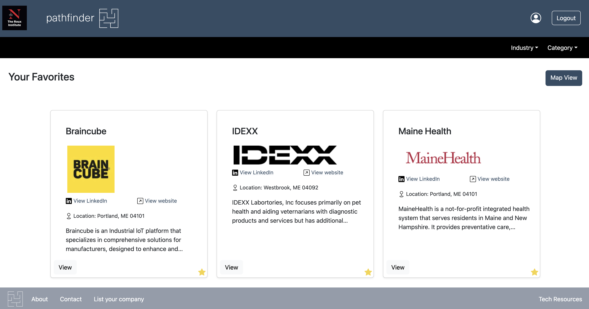
 
 
 

## User Stories

|User Story 1 |Casual Research|
|---------------------|-----------------------------------------------------------------|
|Primary actor | Unregistered or not-logged-in site visitor|
|Actor’s Goal| To learn about companies with tech-related positions in Portland, ME that are not featured at the Roux or may not have an active online presence.|
|Preconditions| The site has been populated with data about local companies|
|Scenario|1. Site visitor navigates to home page  2. Site visitor selects “View Directory”   3. Site visitor clicks “Filter”  4. Site visitor enters keywords, or selects from a set of presented options *Keywords include type of company, industry, and whether the company has an established relationship with the Roux 5. Site visitor enters a zip code to further filter companies by location. 6. Site visitor is presented with a narrowed list of companies that match their filter options.  7. Site visitor can select one of these companies to view its profile. 8. Profile page shows information about the company, including its location on a google map.|

 
 

|User Story 2 |Registration|
|---------------------|-----------------------------------------------------------------|
|Primary actor | Unregistered site visitor|
|Actor’s Goal| To create a profile to enhance use of the site.|
|Preconditions| The site has a functional registration system and a backend that stores users’ profiles|
|Scenario|1. Site visitor navigates to landing page  2. Site visitor selects “Join”   3. Site visitor enters a name, email, and password  4. Site visitor is shown an “Account Created” message and routed to a log-in page.|

 
 

|User Story 3 |Persistent Search|
|---------------------|-----------------------------------------------------------------|
|Primary actor | Registered User|
|Actor’s Goal| To identify companies that match their skills or location and retain for future site visits without needing to filter or search again.|
|Preconditions| The User has an account, and the site’s company data is populated.|
|Scenario|1. Site visitor navigates to landing page  2. Site visitor selects “Login  3. Site visitor enters their email and password and is logged in.  4. Logged-in user rerouted to home page, now showing personalized welcome message.  5.Logged-in user is clicks “Profile” to view their profile page.  6. As in use case 1, “Casual Research,” steps 2-7, the user is able to navigate to the directory, filter the companies, and select a single company.  7. Logged-in user clicks “Favorite” (or Heart symbol), which updates to show that the company has been recorded as a favorite.  8. Logged-in user returns to their profile pag  9. Logged-in user selects “My Favorites”  10. Logged-in user is shown a list of companies that they have favorited.|

 
 

|User Story 4 |Request Inclusion|
|---------------------|-----------------------------------------------------------------|
|Primary actor | Local Company Representative|
|Actor’s Goal| To get their company listed on Pathfinder|
|Preconditions| None|
|Scenario|1. Local company representative navigates to landing page  2. Local company representative selects “List Your Company"|

 
 

|User Story 5 |Contact Admins|
|---------------------|-----------------------------------------------------------------|
|Primary actor | Any Site Visitor|
|Actor’s Goal| To report an inaccuracy in data or an issue using the site|
|Preconditions| None|
|Scenario|1. Site visitor navigates to landing page  2. Site visitor selects “Contact"  3. Site visitor is directed to a Web Form that requests name, email, subject, and message  4. Web Form Info is stored on the backend for retrieval by site administrators, who act on the issue. |

 
 

|User Story 6 |Read Messages|
|---------------------|-----------------------------------------------------------------|
|Primary actor | Admin users|
|Actor’s Goal| To read messages sent in via web forms
|Preconditions| Webform message data is stored successfully|
|Scenario|1. Admin logs in and admin options are made available on home page  2. Admin selects “Read User Contacts”  3. Admin selects “Company Requests”  4. Admin reviews web form submissions to the company web form.  5. Admin returns to “Read User Contacts”  6. Admin selects “User Messages”  7. Admin reviews web form submissions to the user contact web form. |

 
 

## Initial Database Design
ER Diagram: 
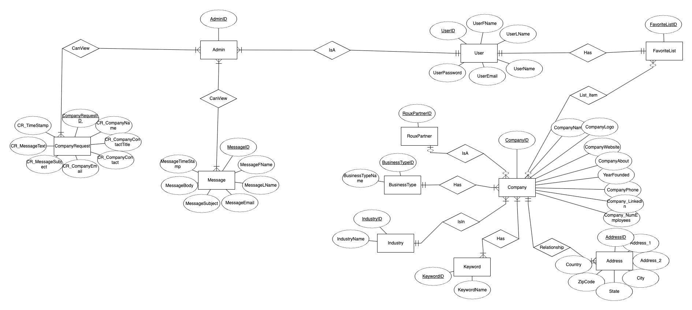

Relational Model: 
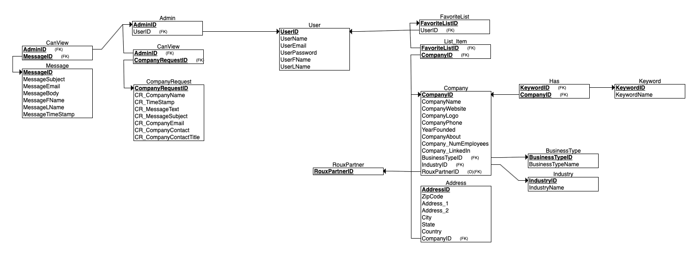

## Initial UI Design
Referenced Builtin, LinkedIn, and The Roux Institute’s websites for design and layout inspiration and information design. The logo was created in Illustrator.

Color Accessibility: 
(via Adobe Color) 
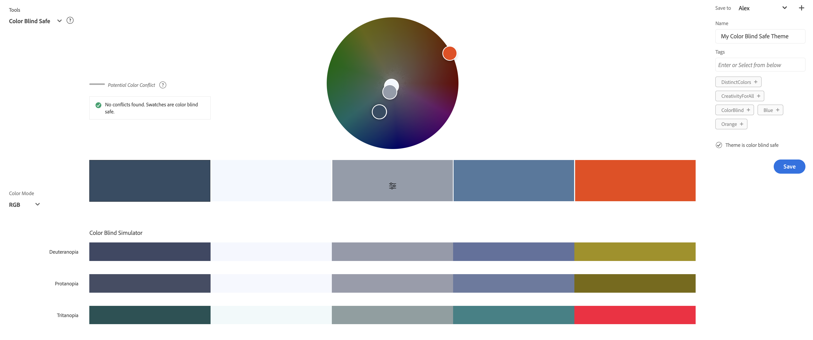
 
 

Home Page: 
(designed on Figma) 
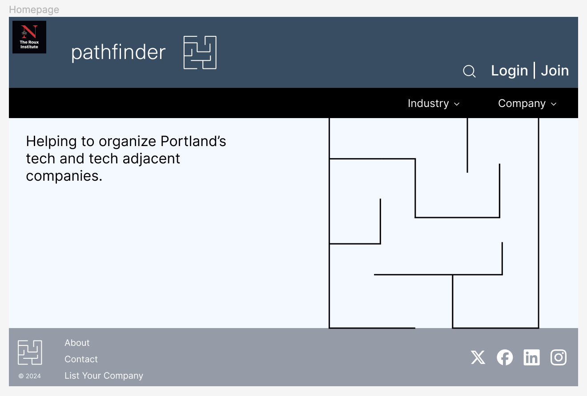
 
 

User 1 - Industry Hover Example: 
(designed on Figma) 
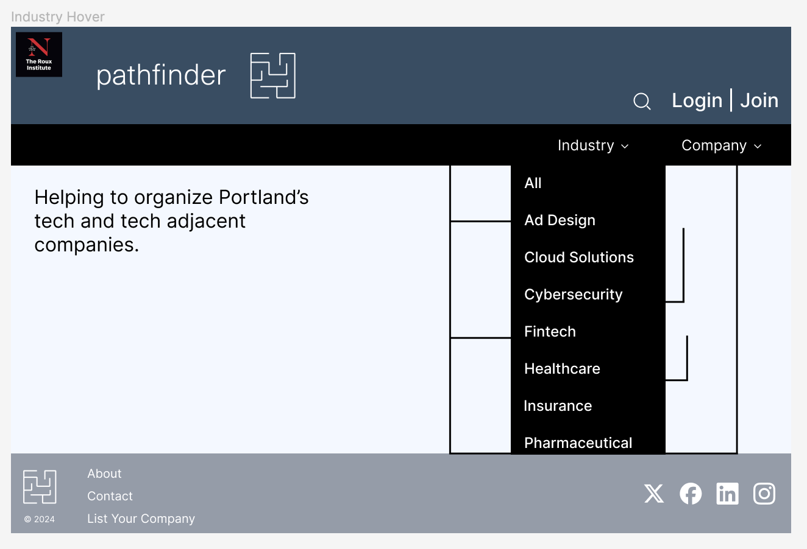
 
 

User 2 - Join Example: 
(designed on Figma) 
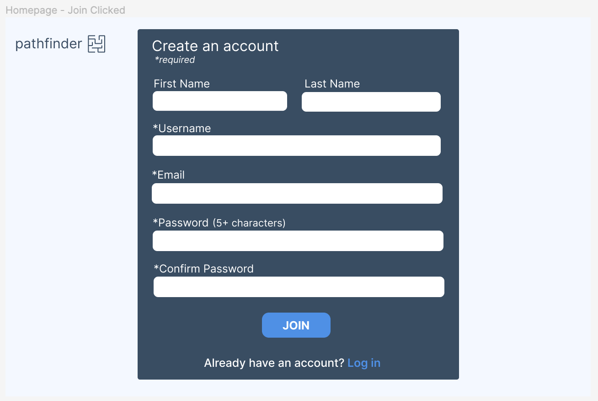
 
 

User 3 - Company Profile Page Example: 
(designed on Figma) 
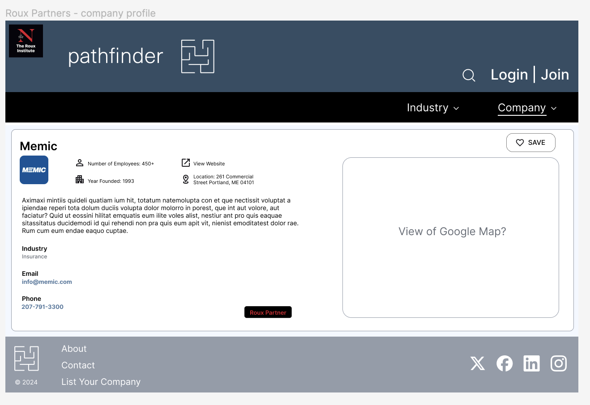
 
 

User 5 - Contact Form Example: 
(designed on Figma) 
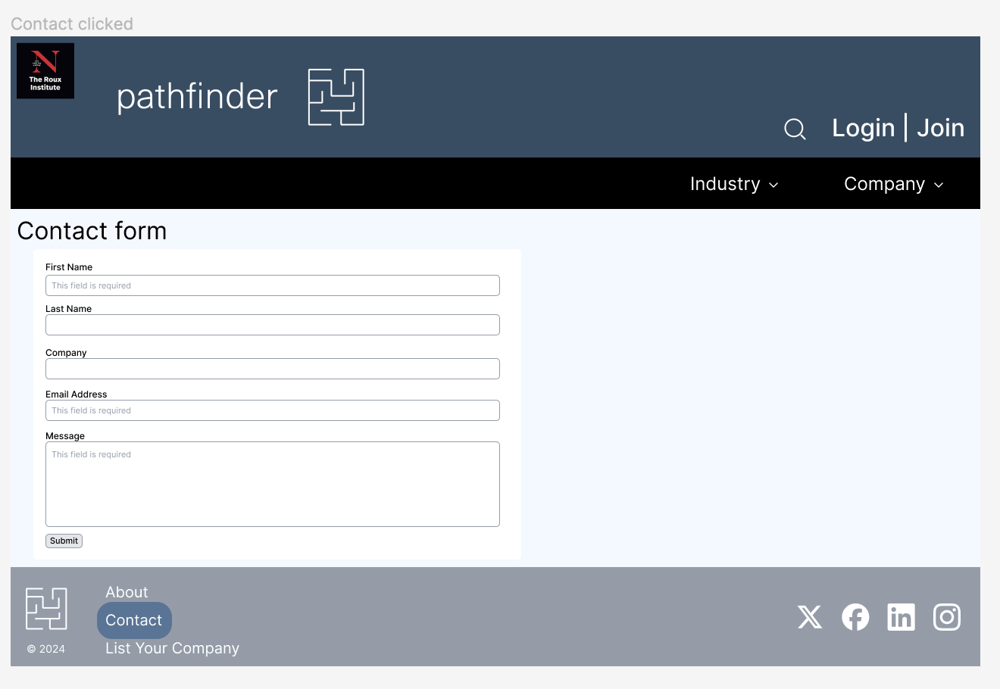
 
 
 
